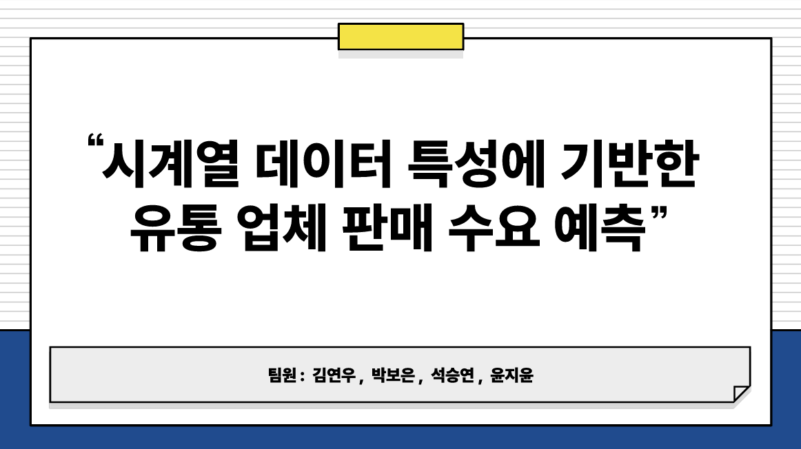

# Portfolio Projects

## Projects Overview

|  |  |

|:-----------------------------------------------------------------:|:-----------------------------------------------------------------:|
| **Project 1**  태풍 데이터 분석                      | **Project 2**  물류 시계열 데이터 분석 및 딥러닝                         |

|   |  |
|:----------------------------------------------------------------:|:----------------------------------------------------------------:|
| **Project 3** 기후변환 데이터 분석              | **Project 4** Short description for project 4                |

## Additional Resources

Click the thumbnail above to watch the video on YouTube: **"Title of the Video"**.
